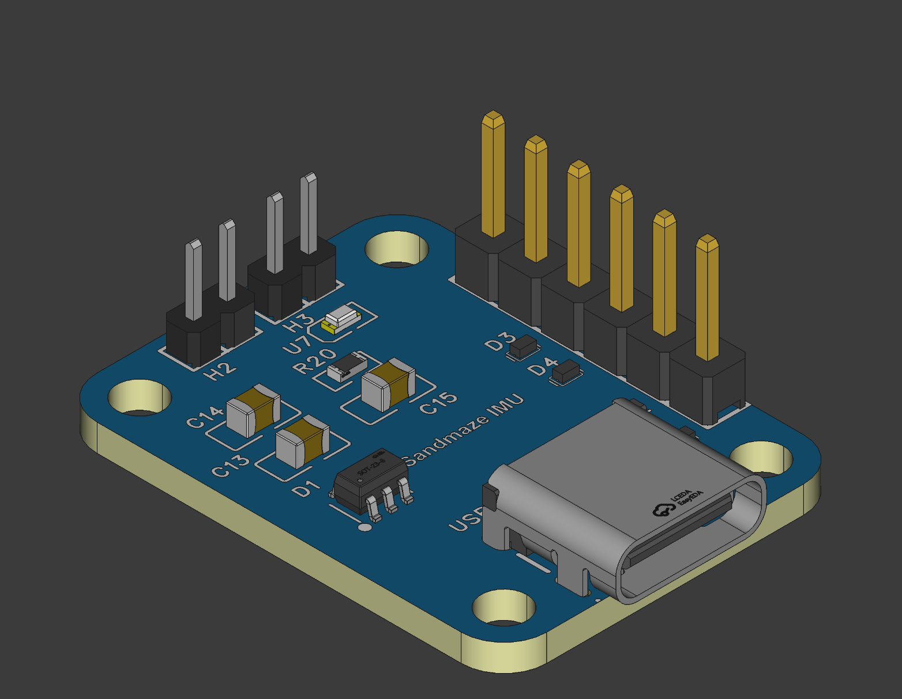
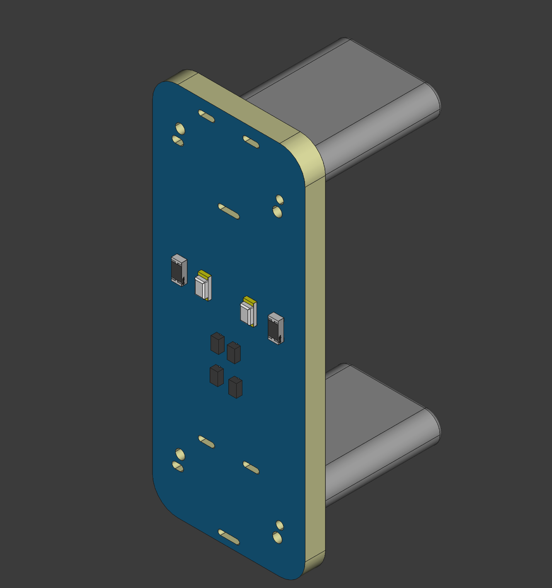

# Notes and analysis of the three boards designed by last years' group:

## Board 1/Rpi Head

## Board 2/IMU Connector
This is repinning the I2C interface of the IMU to run over a USB Type-C connector.
Also includes many ESD and circuit protection features.

* Pinout: Standard USB2 Type-C (incl CC), except DP := **SDA**, DN := **SCL**, SUB := **SCL**
* U7 is a power indicator LED
* H2 and H3 are two, 2-pin 2mm pitch headers for debugging 5V/GND and SDA/SCL
* Includes 300nF decoupling on the 5V bus
* [H5VL10B](https://www.lcsc.com/datasheet/C7420372.pdf) ESD protection diodes between 5V, SDA, and SCL to ground
* [SRV05-4 "RailClamp"](https://www.mouser.ca/ProductDetail/Semtech/SRV05-4.TCT?qs=rBWM4%252BvDhIe0tfPjqKjR5Q%3D%3D) on CC1/2 for ESD protection on the high speed lines, meeting IEC 61000-4-2, Lvl4
  * *I don't think we even need to connect the CC lines*

## Board 3/Fake Wire
Essentially a 180 degree USB Type-C adapter, to connect USB6/Pi Power from the HAT to the RPi. 
* Oddly, maintains two nets for VBUS, VBUS1 and VBUS2, each with their own ESD diodes and debug LEDs. Only difference is which side of the connector they come from (A vs B).
  * Does this have something to do with the non-standard power running? RPi Head may reveal this
* Same H5VL10B diodes on CC, VBUS
* **Point of improvement: Respinning the board such that the SMD are on the inside (less likely to be knocked off)**

