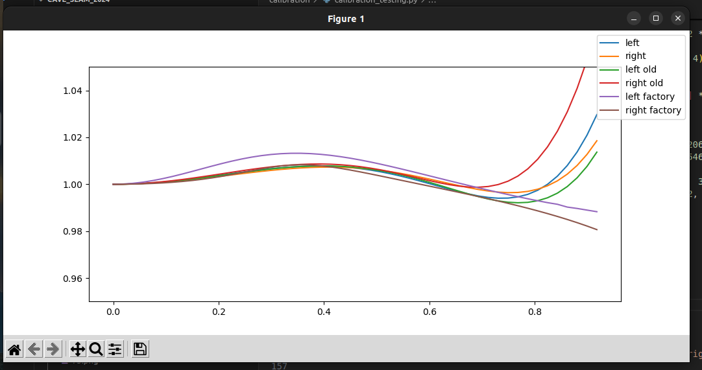

# Calibration scripts
I tried a bunch of things and there are several scripts here that were only useful to me as I learned the process and probably will be useful no more.
## Final calibration method
I pulled the factory calibration from the oak d pro (saved here as calib_xxx.json) and used that, but I calculated my own stereo rectification matrices with opencv. stereo_calibration.py is what I used for that.
## Resources
https://docs.opencv.org/4.5.4/d9/d0c/group__calib3d.html#ga91018d80e2a93ade37539f01e6f07de5  

https://docs.opencv.org/4.x/dc/dbb/tutorial_py_calibration.html

## files

### save_pics.py
Plug the oak camera in and use this script to save a bunch of pictures of the chessboard (pdf is also included here).

### depthi_calibdata.py
From depthai docs, useful for reading values of factory calibration

### calibration_testing.py
Using this script I was successfully finding distortion parameters of camera from chessboard pics, and was also comparing those to the factory distortion parameters.  

### stereo_calibration.py
Used to calculate the rectification matrices and maps for remap function, assuming that the factory distoration parameters are true. You could also calculate your own distoration parameters but I decided the factory ones were a little better especially at the edges of the frames.

### stereovision_calibration.py
From a youtube tutorial:
https://www.youtube.com/watch?v=yKypaVl6qQo
https://github.com/niconielsen32/ComputerVision/tree/master/stereoVisionCalibration

### check_calibration.py
Shows calibrated and rectified live video for checking results.

### opencv_example.py
This was not super helpful to me for whatever reason.